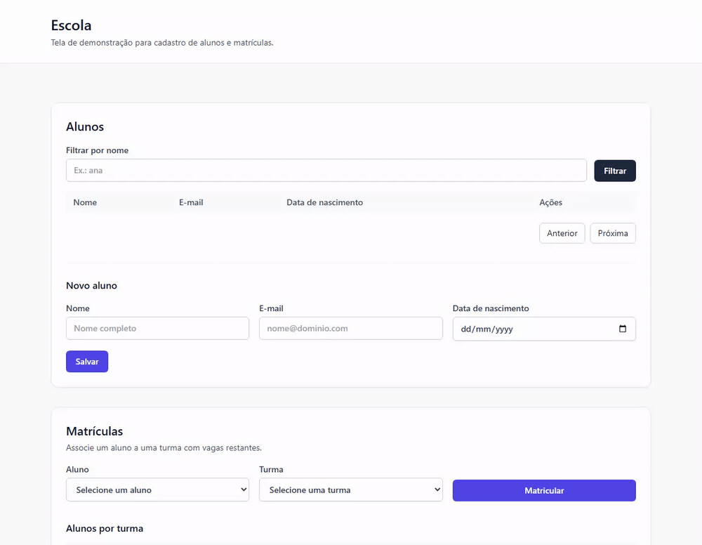

# API de matrícula escolar

API de controle de matrículas de uma escola, feita para o teste prático de .NET Pleno. A stack segue o enunciado à risca: **.NET Framework 4.8** com **ASP.NET Web API 2**, **SQL Server** acessado por **Dapper** com SQL escrito na mão, e **Redis** como cache. O host roda no Windows; SQL Server e Redis sobem no Docker.

## O que o enunciado pede e onde isso está

Um resumo de como cada requisito obrigatório foi atendido, para facilitar a revisão:

| Requisito do enunciado | Como foi atendido |
| --- | --- |
| **CRUD de alunos** (`GET/POST /api/alunos`, `GET/PUT/DELETE /api/alunos/{id}`) | `AlunosController` + `AlunoService` + `AlunoRepository`. A listagem é paginada, aceita filtro opcional por nome e retorna o total de registros no corpo (`total`). |
| **Exclusão lógica** do aluno (campo `Ativo`) | `DELETE` faz `Ativo = 0`; a row continua no banco. Listagem e busca por id ignoram inativos (404 por id). |
| **Turmas** (`GET /api/turmas` com vagas restantes) | `TurmasController` + `TurmaService`; as vagas vêm de `VagasDisponiveis`. |
| **Matrícula** (`POST /api/matriculas`) com regras de negócio | `MatriculaService` valida turma com vaga, aluno ativo e matrícula não duplicada; o insert e o decremento de `VagasDisponiveis` rodam na **mesma transaction**. |
| **Relatório** (`GET /api/relatorios/alunos-por-turma`) via SQL | `RelatorioRepository` calcula tudo com `LEFT JOIN` + `GROUP BY`, sem montar o resultado em memória. |
| **Status HTTP corretos** (200/201, 400, 404, 409) | Exceções de domínio (`ValidationException`, `NotFoundException`, `ConflictException`) são traduzidas por um filtro; validação nunca devolve 500. |
| **Projeto em camadas**, sem regra de negócio no controller | Camadas `Api` → `Aplicacao` → `Dominio` ← `Infraestrutura`, com Autofac na composição. |

Itens bônus do enunciado, todos implementados:

- **Cache com Redis** na listagem de turmas (`turmas:listagem`, TTL de 5 minutes), invalidado após uma matrícula com sucesso. Fica atrás da interface `ICacheService`, então dá para trocar por uma implementação em memória sem tocar no serviço.
- **Testes unitários** da regra de matrícula (além de outros), em `Escola.Testes.Unitarios`.
- **Tela simples** que consome a listagem de alunos e ainda cobre o CRUD, matrícula e relatório — servida em [http://localhost:5000/ui](http://localhost:5000/ui).

Nada ficou de fora dos requisitos obrigatórios ou dos bônus.

## Stack

- .NET Framework 4.8
- ASP.NET Web API 2 hospedada no IIS / IIS Express (OWIN `Startup`)
- SQL Server com Dapper e SQL parameterized
- Redis via StackExchange.Redis (`ICacheService`)
- Autofac para composition
- Swashbuckle 5.6.0 para o Swagger UI

## Demonstração

O fluxo completo de CRUD na tela `/ui` — listar e filtrar alunos, cadastrar, editar, matricular em uma turma, ver o relatório e excluir (desativação lógica):



## Requisito Windows

Build da solution, hosting da API e execução dos testes exigem **Windows** com:

- .NET Framework 4.8 Developer Pack
- Visual Studio 2022 (ou MSBuild + NuGet + IIS Express)
- Docker Desktop (para SQL Server e Redis)

A API **não** roda em macOS, Linux, nem em um container Linux. O Docker é usado só para SQL Server e Redis. As portas do host **1433** (SQL Server) e **6379** (Redis) precisam estar livres antes de `make infra-up`. Em Apple Silicon, a imagem do SQL Server 2022 sobe via emulação amd64.

## Como rodar localmente

A partir de `apps/backend`:

```bash
make restore
make infra-up
make api-run
```

`make infra-up` sempre reaplica o schema e as linhas de sample em `TesteEscola` e faz flush do Redis db 0. **Não** é necessário `make infra-reset` depois de uma mudança de schema ou seed.

`make api-run` compila a API, sobe a infrastructure e inicia o IIS Express em [http://localhost:5000](http://localhost:5000). Sobrescreva o path do IIS Express se precisar:

```bash
make api-run IIS_EXPRESS="C:\Program Files\IIS Express\iisexpress.exe"
```

Alternativamente, abra `Escola.sln` no Visual Studio e pressione F5 (a URL do project é `http://localhost:5000/`).

### Infrastructure Docker

```bash
make infra-up      # SQL Server :1433 e Redis :6379, reseed de TesteEscola, flush do Redis db 0
make infra-logs    # acompanha os logs dos containers
make infra-down    # para os containers
make infra-reset   # apaga os volumes Docker e depois infra-up (opcional; não é necessário após mudanças de schema)
```

Não existe imagem Linux para o processo da Web API.

### Connection strings (somente local)

Essas credentials de development **não são para production**.

| Setting | API (`Web.config`) | Testes de integration (`App.config`) |
| --- | --- | --- |
| SQL Server | `Server=localhost,1433;Database=TesteEscola;User Id=sa;Password=Escola_Dev_P@ssw0rd;Encrypt=True;TrustServerCertificate=True` | Mesmo server, database `TesteEscola_Testes` |
| Redis | `localhost:6379,abortConnect=false` (db lógico 0) | `localhost:6379,abortConnect=false,defaultDatabase=1` |

`TesteEscola_Testes` é criado e recebe seed só quando os testes de integration rodam. O Compose / `make infra-up` não cria esse database.

## Health check

Com a infrastructure e a API no ar:

```bash
curl http://localhost:5000/api/health
```

- HTTP 200 quando SQL Server e Redis estão reachable (`status`: `healthy`)
- HTTP 503 quando qualquer dependency está down (`unavailable` em `sqlServer` e/ou `redis`)

## Swagger

Abra [http://localhost:5000/swagger](http://localhost:5000/swagger) (UI) ou `http://localhost:5000/swagger/docs/v1` (documento OpenAPI). As rotas do enunciado têm description em inglês (en-US) e schemas de request/response (propriedades, tipos e campos).

## Tela de demonstração

Depois de `make api-run`, abra [http://localhost:5000/ui](http://localhost:5000/ui) no navegador. A página HTML é servida na mesma origem da API e permite listar, cadastrar, editar e excluir alunos, criar matrículas e ver o relatório de alunos por turma. Se `/ui` não abrir, use [http://localhost:5000/ui/index.html](http://localhost:5000/ui/index.html).

## Endpoints do enunciado

O JSON é camelCase. Bodies de erro usam `{ "error": "<mensagem em pt-BR>" }` com HTTP 400 (validation), 404 (registro ausente) ou 409 (regra de negócio).

### Alunos

CRUD paginado com filtro opcional por nome; o total de registros vem no corpo da resposta.

```bash
curl http://localhost:5000/api/alunos
curl "http://localhost:5000/api/alunos?nome=ana&pagina=1&tamanhoPagina=10"
curl http://localhost:5000/api/alunos/1
curl -X POST http://localhost:5000/api/alunos -H "Content-Type: application/json" -d "{\"nome\":\"Ana Souza\",\"email\":\"anasouza2345@email.com\",\"dataNascimento\":\"2006-03-14\"}"
curl -X PUT http://localhost:5000/api/alunos/1 -H "Content-Type: application/json" -d "{\"nome\":\"Ana Souza\",\"email\":\"ana.souza@email.com\",\"dataNascimento\":\"2006-03-14\"}"
curl -X DELETE http://localhost:5000/api/alunos/1
```

`dataNascimento` é somente `YYYY-MM-DD`. O email precisa ser um address completo (local-part com ou sem ponto). DELETE é uma desativação lógica (`Ativo = 0`); GET da listagem e GET por id omitem alunos inativos (HTTP 404 por id). A row permanece no database para a matrícula ainda poder recusar um aluno inativo com HTTP 409.

### Turmas

Lista as turmas com a quantidade de vagas restantes de cada uma.

```bash
curl http://localhost:5000/api/turmas
```

As vagas restantes vêm de `VagasDisponiveis`. A listagem fica em cache no Redis (`turmas:listagem`, TTL de 5 minutes) e é invalidada após uma matrícula com sucesso.

### Matrículas

Recebe o id do aluno e o id da turma e aplica as regras de negócio do enunciado.

```bash
curl -X POST http://localhost:5000/api/matriculas -H "Content-Type: application/json" -d "{\"alunoId\":1,\"turmaId\":2}"
```

O insert e o decrement de vagas rodam em uma única transaction: ou tudo grava, ou nada. Aluno inativo, turma sem vagas ou par aluno/turma duplicado retornam HTTP 409.

### Relatório

Retorna, por turma, o nome da turma, a quantidade de alunos matriculados e as vagas restantes.

```bash
curl http://localhost:5000/api/relatorios/alunos-por-turma
```

As contagens são calculadas em SQL (`LEFT JOIN` + `GROUP BY`), incluindo turmas com zero enrollments — nada é montado em memória no C#.

## Testes

```bash
make test-unit          # Docker não é necessário
make test-integration   # sobe a infra Docker e depois cria TesteEscola_Testes / faz flush do Redis db 1
make test               # unit e em seguida integration
```

## Script de schema

`infra/sql/init.sql` começou como cópia de `Enunciado/C#/script-banco.sql`. Ele adiciona `CONSTRAINT UQ_Matricula_Aluno_Turma UNIQUE (AlunoId, TurmaId)` para que enrollments duplicados concorrentes não persistam. Cada `make infra-up` re-drop/recria as tables da API em `TesteEscola`, faz reseed das rows de sample e flush do Redis db 0. `make infra-reset` não é necessário para aplicar esse unique index.

## Targets do Make

| Target | Ação |
| --- | --- |
| `restore` | `nuget restore Escola.sln` |
| `infra-up` | Sobe SQL Server e Redis, reseed de `TesteEscola`, flush do Redis db 0 |
| `infra-down` | Para os containers |
| `infra-logs` | Acompanha os logs do Compose |
| `infra-reset` | `down -v` e depois `infra-up` (wipe de volume; opcional) |
| `api-run` | `infra-up`, build da API e IIS Express na porta 5000 |
| `test-unit` | Restore, MSBuild e execução do project de testes unitários |
| `test-integration` | `infra-up` e depois execução do project de testes de integration |
| `test` | Testes unitários e em seguida testes de integration |
