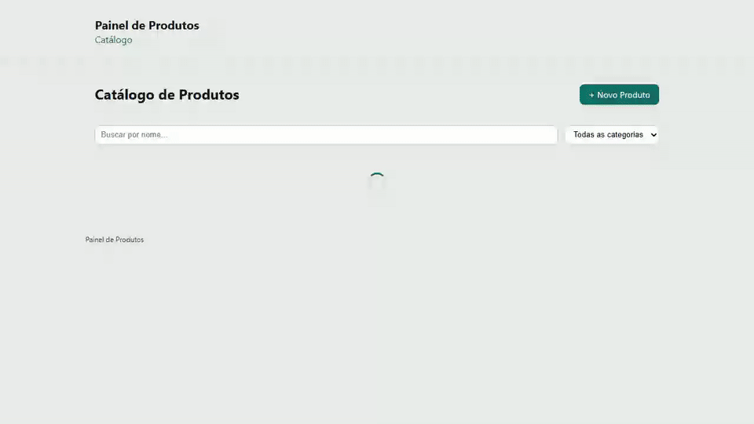

# Painel de gerenciamento de produtos

SPA em React que consome uma API REST para gerenciar um catálogo de produtos, feita para o teste prático de front-end. A stack segue o enunciado: **React 19** com **TypeScript**, build e dev server no **Vite**, roteamento com **React Router** e a API fake do **json-server** sobre o `db.json` fornecido. Todas as mensagens da UI estão em pt-BR.

## O que o enunciado pede e onde isso está

Um resumo de como cada requisito foi atendido, para facilitar a revisão:

| Requisito do enunciado | Como foi atendido |
| --- | --- |
| **Listagem de produtos** (tabela, busca, filtro, paginação real, total) | `pages/Home.tsx` monta a tabela; a busca por nome, o filtro por categoria e a paginação vão para a API (`_page`, `_limit`, `nome_like`, `categoria`), e o total vem do header `X-Total-Count`, não de fatiar tudo no front. |
| **Estados de carregando, erro e vazio** | `Home` alterna entre `LoadingSpinner`, `ErrorMessage` e um estado vazio ("Nenhum produto encontrado") conforme o resultado da chamada. |
| **Detalhe do produto** | `pages/ProductDetail.tsx` carrega o produto por id e mostra os dados completos. |
| **Criar e editar** com validação por campo | `pages/ProductForm.tsx` usa React Hook Form: nome obrigatório com mínimo de 3 caracteres, preço maior que zero e estoque zero ou mais. As mensagens aparecem ao lado de cada campo (`role="alert"`), não em um alert genérico. |
| **Feedback de sucesso ao salvar** | Após criar ou editar, o formulário mostra uma mensagem de sucesso e redireciona para o catálogo. |
| **Excluir com confirmação** | `components/ConfirmDialog.tsx` pede confirmação antes do DELETE; depois de excluir, a listagem é atualizada com uma mensagem de sucesso. |
| **Chamadas de API centralizadas** | Todo o acesso HTTP fica em `shared/api/products.ts`; os componentes só falam com hooks (`useProducts`, `useProduct`, `useSaveProduct`, `useDeleteProduct`), sem `fetch` solto. |
| **Componentização** | Páginas em `pages/`, componentes reutilizáveis em `shared/components/` e hooks em `shared/hooks/`; nenhum arquivo monolítico. |

Itens bônus do enunciado, todos implementados:

- **TypeScript bem usado** — o tipo `Produto` e o `ListResult<T>` da API são tipados e reaproveitados pelos hooks e páginas.
- **Debounce na busca** — `useDebounce` aguarda 300 ms antes de disparar a chamada enquanto o usuário digita.
- **Testes com React Testing Library** — Vitest com RTL e MSW cobrem as páginas e os hooks (unit e integration).
- **React Router refletindo o estado na URL** — página, busca (`q`) e categoria ficam nos query params, então recarregar ou compartilhar o link preserva a tela.

### Extras além do enunciado

Dois pontos que o enunciado não pede, mas que foram incluídos como destaque:

- **Testes end-to-end (Playwright)** — além dos testes de unidade/integração, uma suíte e2e roda o app de verdade no browser cobrindo os fluxos principais: listagem com total, paginação refletida na URL, busca e filtro, detalhe do produto, criação/edição no formulário e exclusão com confirmação (`e2e/`).
- **Acessibilidade** — a interface foi construída com atenção a acessibilidade e é verificada automaticamente com o `axe` (nos testes e2e e de integração, exigindo zero violações). Os principais pontos:
  - **Skip link** "Ir para o conteúdo" como primeiro elemento focável, levando direto ao `<main>` (`app/AppShell.tsx`).
  - **Landmarks semânticos** — `header`/`banner`, `main`, `footer`/`contentinfo` e `nav` com `aria-label`.
  - **Idioma declarado** — `<html lang="pt-BR">`, coerente com o conteúdo da UI.
  - **Formulário acessível** — cada campo tem `<label>` associado, `aria-invalid` quando inválido e mensagens de erro com `role="alert"` ao lado do campo (`pages/ProductForm.tsx`).
  - **Feedback por região viva** — mensagens de sucesso com `role="status"`, anunciadas por leitores de tela.
  - **Controles com nome acessível** — busca, filtro por categoria, paginação (`Página anterior`/`Próxima página`) e o botão de excluir (`Excluir <nome>`) expõem `aria-label` (`pages/Home.tsx`).
  - **Diálogo de confirmação** — usa o elemento `<dialog>` nativo com `showModal()`, `aria-labelledby` e `aria-describedby` (`shared/components/ConfirmDialog.tsx`).

## Stack

- React 19 + TypeScript
- Vite (dev server e build)
- React Router 7 para o roteamento
- React Hook Form para o formulário e a validação
- json-server 0.17.4 como API fake (compatível com o enunciado)
- Vitest + React Testing Library + MSW para testes; Playwright + axe para e2e

## Demonstração

O fluxo completo de CRUD: busca na listagem, cadastro de um produto com validação, visualização do detalhe, edição e exclusão com confirmação.



## Pré-requisitos

- Node.js >= 20.19

## Como rodar localmente

A partir de `apps/frontend`, instale as dependências:

```bash
npm install
```

O jeito mais rápido de subir tudo é rodar a API fake e o app juntos:

```bash
npm run dev:all
```

Isso levanta o json-server em [http://localhost:3001](http://localhost:3001) (recurso `/produtos`) e o Vite em [http://localhost:5173](http://localhost:5173). O dev server já faz proxy de `/produtos` para o json-server, então o app funciona sem configuração extra.

Se preferir rodar cada parte separada, em dois terminais:

```bash
npm run api    # json-server em http://localhost:3001
npm run dev    # app em http://localhost:5173
```

## Testes

```bash
npm run test              # unit e integration (Vitest)
npm run test:unit         # só os testes unitários
npm run test:integration  # testes de integração com MSW
```

Para o e2e com Playwright, instale o browser uma vez e depois rode a suíte (ela sobe o dev server sozinha):

```bash
npx playwright install chromium
npm run test:e2e
```

## Estrutura

```
src/
  app/            AppShell com o layout, o skip link e as rotas
  pages/          Home (listagem), ProductDetail, ProductForm, NotFound
  shared/
    api/          products.ts — ponto único de acesso HTTP
    hooks/        useProducts, useProduct, useSaveProduct, useDeleteProduct, useDebounce
    components/   LoadingSpinner, ErrorMessage, ConfirmDialog
  test/           setup, handlers do MSW e testes de integração
e2e/              specs do Playwright
```

## Observações

- Todas as mensagens da UI são em pt-BR.
- O `db.json` incluído é o dataset do enunciado; o json-server aceita GET, POST, PUT e DELETE em `/produtos`.
